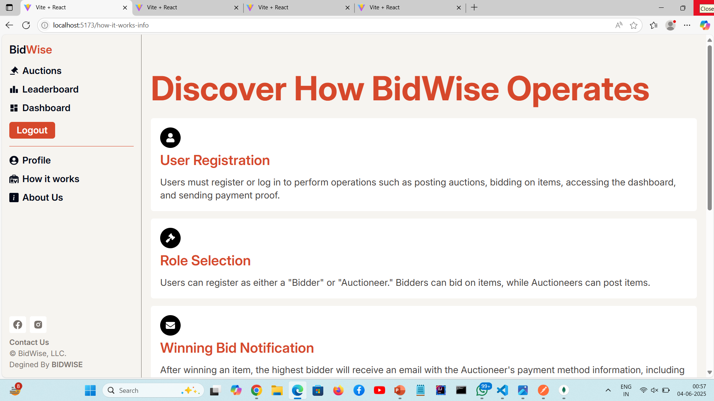
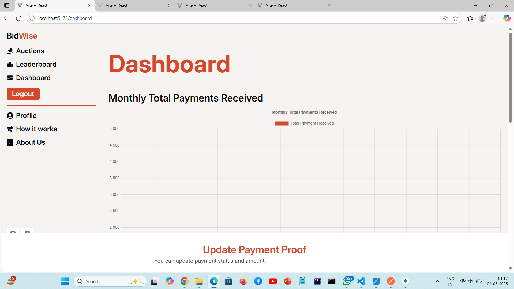
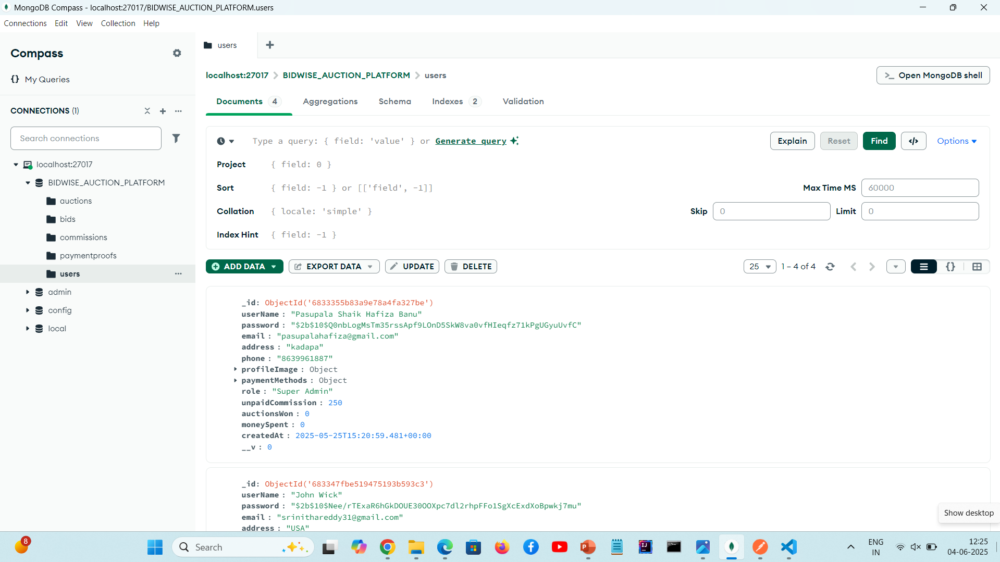
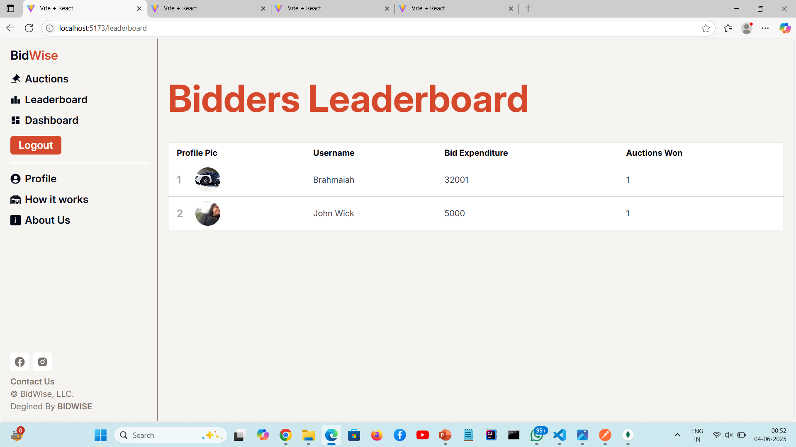

# BidWise: A Secure And Efficient Bidding Platform For a Digital Marketplace

BidWise is a full-stack **online auction and bidding platform** designed to provide a secure, transparent, and efficient digital marketplace where users can create auctions, place bids, and manage auction processes seamlessly.

The platform supports **real-time bidding**, **role-based access**, **automation using cron jobs**, and an **admin dashboard** for monitoring auctions and commissions.


## Problem Statement

Traditional auction systems often lack transparency, automation, and secure user management. Manual handling of auctions and commissions leads to inefficiency and errors.

**BidWise solves this problem by:**
- Automating auction lifecycle management
- Providing secure authentication and authorization
- Offering real-time bidding and analytics
- Ensuring transparent commission handling


## Key Features

### User Features
- User registration and login (JWT authentication)
- Create and manage auctions
- Participate in live bidding
- View upcoming, ongoing, and ended auctions
- Leaderboard for top bidders
- User profile management
- Submit commission proof after winning auctions

### Admin / Super Admin Features
- Admin dashboard with analytics
- Manage users and auction listings
- Verify commission payments
- Monitor auction activity
- Track bidder and auctioneer statistics

### Automation
- Automatic auction ending using cron jobs
- Automatic commission verification tracking
- Background tasks for auction lifecycle management


## Tech Stack

### Frontend
- React (Vite)
- Redux Toolkit
- Tailwind CSS
- JavaScript (ES6)

### Backend
- Node.js
- Express.js
- MongoDB
- Mongoose
- JWT Authentication
- Cron Jobs (node-cron)


## 📁 Project Structure

```text
ONLINE-BIDDING/
├── backend/
│   ├── automation/
│   ├── config/
│   ├── controllers/
│   ├── database/
│   ├── middlewares/
│   ├── models/
│   ├── router/
│   ├── utils/
│   ├── app.js
│   └── server.js
│
├── frontend/
│   ├── public/
│   ├── src/
│   │   ├── assets/
│   │   ├── components/
│   │   ├── pages/
│   │   ├── store/
│   │   ├── App.jsx
│   │   └── main.jsx
│   ├── tailwind.config.js
│   └── vite.config.js
│
├── .gitignore
└── README.md

## Security & Authentication

- JWT-based authentication
- Role-based authorization (User / Admin / Super Admin)
- Protected API routes using middleware
- Secure handling of user credentials

## Screenshots

### Home Page


### Dashboard


### Personal Details


### Auction Page


### Leaderboard



## Environment Setup

Create a `.env` file in `backend/config` and add:

```env
PORT=5000
MONGO_URI=your_mongodb_connection_string
JWT_SECRET=your_jwt_secret
JWT_EXPIRE=7d

How to Run the Project Locally

1. Clone the Repository
git clone https://github.com/banu444/BidWise-A-Secure-And-Efficient-Bidding-Platform-For-a-Digital-Marketplace.git
cd ONLINE-BIDDING

2. Backend Setup
cd backend
npm install
npm run dev

3. Frontend Setup
cd frontend
npm install
npm run dev

Frontend runs on:
http://localhost:5173

Backend runs on:
http://localhost:5000

Future Enhancements

- Real-time bidding using WebSockets
- Online payment gateway integration
- Email & notification system
- Mobile application support
- AI-based bid analytics

Developed By

Pasupala Shaik Hafiza Banu
B.Tech - Computer Science Engineering (AI & ML)
📧 Email: pasupalahafiza@gmail.com
🔗 LinkedIn: https://www.linkedin.com/in/hafiza-banu-pasupala-shaik-3a195b32a/
💻 GitHub: https://github.com/banu444


AFTER ADDING README (NEXT COMMANDS)

```bash
git add README.md
git commit -m "Added project README"
git push

	--tailwind.config.js
	--vite.config.js
